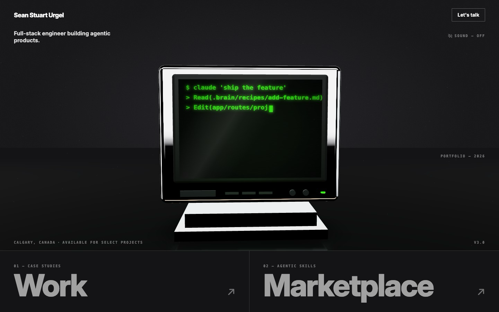
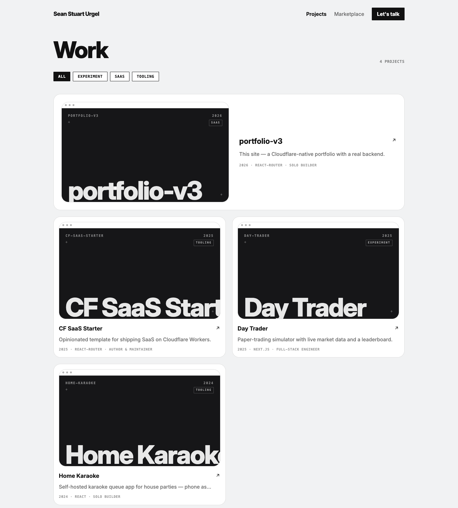
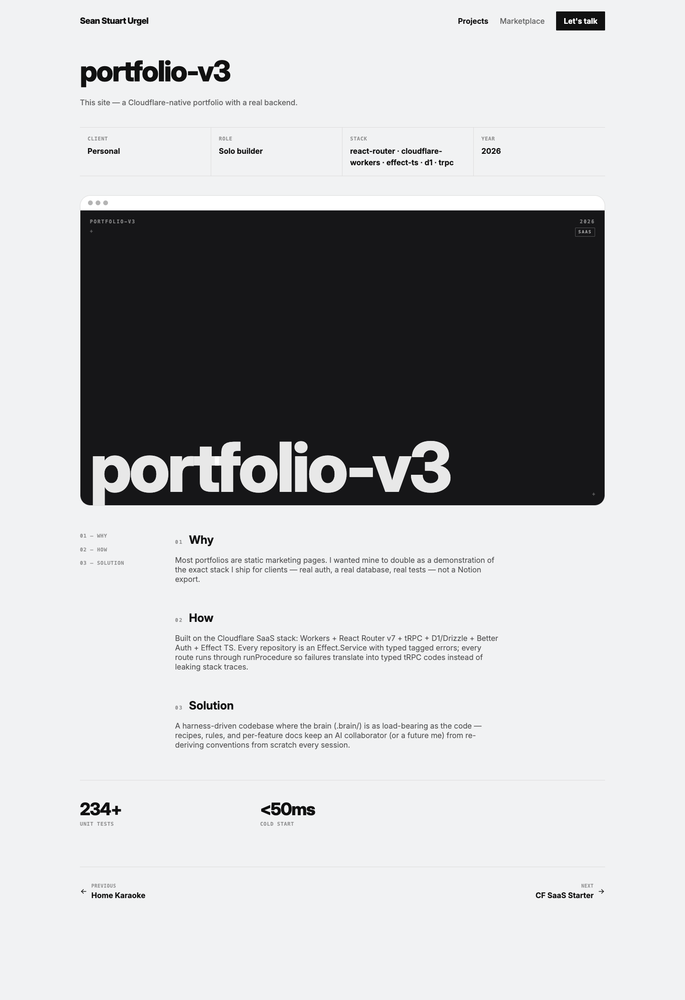
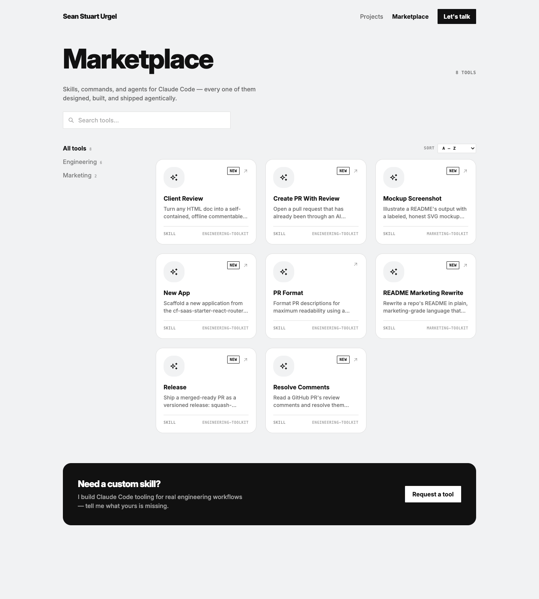

# Sean Urgel — Portfolio (`portfolio-v3`)

A personal portfolio that is also a real, running full-stack app on Cloudflare Workers.

[](https://workers.cloudflare.com/)
[](https://reactrouter.com/)
[](https://effect.website/)
[](https://www.typescriptlang.org/)


## Why this exists

Most engineering portfolios are static marketing pages — a Notion export, a template, a few screenshots. They tell you someone can code without showing it.

This one is different: the portfolio *is* the demo. It runs on the exact production stack Sean ships for clients — Cloudflare Workers, React Router, tRPC, Effect TS, D1 — so browsing the site is the proof. The same runtime that serves this page locally is the one that serves it at the edge. Nothing is faked for the marketing.

The design is deliberately minimal (monochrome neutrals, one neon-green accent, chrome 3D), so the engineering does the talking.

## What's inside

Four surfaces, all real routes in the app.

### Home — the console (a landing page that's also a playable machine)



The home page is a dark render stage with a photorealistic chrome CRT monitor sitting on a reflective floor, its green phosphor screen glowing. It's rendered live with React Three Fiber — and it's interactive. The CRT is a tiny operating system running in the browser:

- **It boots.** On load you get a `URGEL BIOS` memory check, then an attract-mode terminal that auto-types an agentic coding session — `$ claude 'ship the feature'` → `> Read(.brain/recipes/add-feature.md)` → `> Edit(app/routes/...)`. (That's what the screenshot above shows.)
- **You can type to it.** Start typing anywhere on the page and a live terminal opens. Real commands work: `help`, `whoami`, `ls`, `cat <file>`, `contact`, `matrix`, `pong`, `starfield`, `clear`, `exit` — and `sudo hire sean`, which returns `PERMISSION GRANTED`.
- **You can play with it.** Click the tube to cycle screen modes: Matrix rain, a self-playing Pong match, a fly-through starfield. Leave it alone for 60 seconds and a bouncing-logo screensaver kicks in. Click the power LED to switch the whole CRT off — and on again, with a full boot animation.
- **It reacts.** Neon-green (`#39ff14`) lasers flare across the stage on hover, with optional WebAudio sound (key clacks and laser zaps) behind a `SOUND` toggle.

Two large section links dock the bottom of the page: **01 — CASE STUDIES → Work** and **02 — AGENTIC SKILLS → Marketplace**.

**One technical detail worth knowing:** the entire OS — the boot sequence, the terminal, Matrix, Pong, the starfield — is driven by pure state machines with unit tests that run with no browser at all. Only the three.js/WebGL rendering is client-side, and that lives in a `.client`-only module stripped out of the Cloudflare Workers server bundle entirely. That's how a playful 3D toy still ships behind a fast server render: the heavy graphics never touch the edge runtime, and the logic behind the toy is tested like any other code.

### Work — the showcase



A grid of selected projects with a featured card up top and category filter pills (**All / Experiment / SaaS / Tooling**). Four projects live here: this portfolio, a Cloudflare SaaS starter, a day-trading tool, and a home karaoke build. Each card links to its full case study.

### Case studies — WHY / HOW / SOLUTION



Every project has a long-form case study at `/projects/:slug`, structured as **WHY → HOW → SOLUTION**. Each opens with a meta table (client, role, stack, year) and a stat row of the numbers that mattered — for this site, **234+ unit tests** and a **<50ms cold start**. Previous/next links let you walk the whole set.

### Marketplace — skills built agentically



A small, curated set of Claude Code tools Sean actually built and ships — *"skills, commands, and agents for Claude Code, every one of them designed, built, and shipped agentically."* Quality over quantity: **8 tools** across two categories, **Engineering** (6) and **Marketing** (2).

They automate his own engineering workflow — Create PR With Review, Release, Resolve Comments, PR Format, New App, Client Review, README Marketing Rewrite, and Mockup Screenshot. The page has live search, an A–Z sort, a `NEW` badge on the recent additions, and a "Need a custom skill? … Request a tool" banner for anyone who wants tooling built for their own workflow.

## How the content works

Here's the part that's easy to miss: the site reads like a CMS, but there is no CMS.

Every page's content — all the projects and all the marketplace tools — lives as plain markdown files bundled into the app under `content/` (`content/projects/*.md`, `content/skills/*.md`). Add a markdown file, get a new case study or catalog entry. No database queries, no admin panel, no external service.

The database (Cloudflare D1) does exactly one job: it holds auth data — users and sessions. Content is static and fast; the backend is real where it needs to be.

## Built with

The stack is picked so local development and production are the *same thing*, and so mistakes are caught by the type system instead of in production.

- **Cloudflare Workers** — no Node.js. The app runs on the Workers runtime on your laptop and at the edge, so "works on my machine" and "works in prod" are the same claim.
- **React Router v7 (SSR)** — server-rendered routing and data loading.
- **tRPC v11, wrapped in Effect TS** — end-to-end typed server calls. Effect makes error handling explicit: no thrown exceptions, every failure is a typed value, and tagged errors map cleanly to tRPC status codes.
- **D1 + Drizzle ORM** — SQLite at the edge, typed queries, versioned migrations. Used only for auth.
- **Better Auth** — sessions and role-based access control (RBAC), enforced on both the page and the server procedure.
- **Effect Schema** for validation (no Zod), **ShadCN / Radix + Tailwind v4** (oklch color) for UI.
- **i18n** via remix-i18next — English and Chinese.
- **Testing:** Vitest for unit tests, Playwright for end-to-end.

## Run it locally

**Prerequisites**

- [Bun](https://bun.sh) — package manager and runtime.
- A logged-in Cloudflare CLI, only if you plan to deploy: `bun add -g wrangler && wrangler login`.

**Commands**

```bash
bun install       # install dependencies
bun run dev       # dev server → http://localhost:5173
bun run build     # production build
bun run deploy    # build + deploy to Cloudflare Workers
bun run typecheck # cf-typegen + react-router typegen + tsc
bun run test      # Vitest unit tests
bun run test:e2e  # Playwright end-to-end tests
```

`bun run dev` applies local database migrations automatically before starting.

---

Built by **Sean Urgel** — full-stack engineer building agentic products. Calgary, Canada · available for select projects.

[Let's talk →](mailto:sean@casperstudios.xyz)
